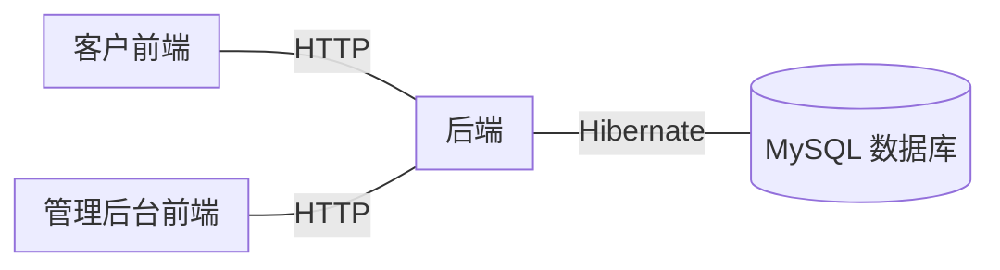
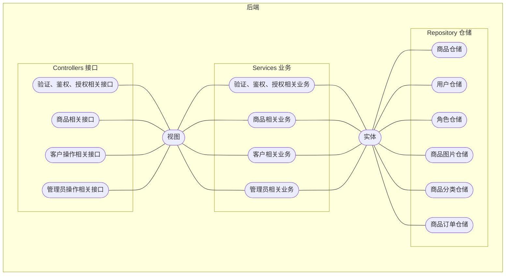
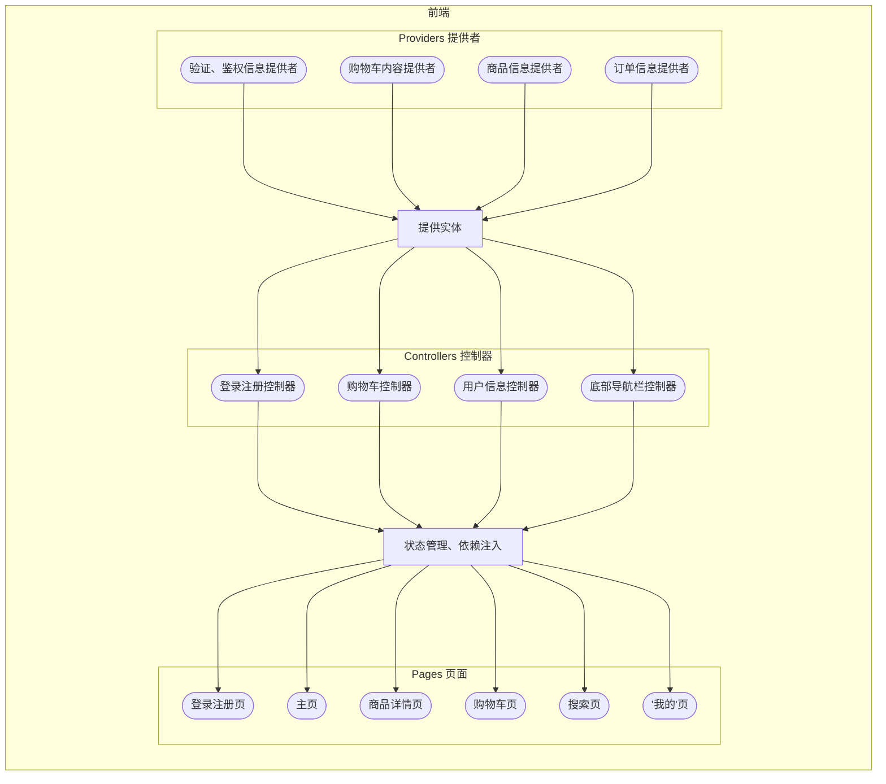

# 基于 Spring 和 Flutter 的前后端分离电商平台


## 项目架构

### 总体架构



### 后端架构



### 前端架构



## 如何运行

> 在编译前请确保当前环境中已经有如下工具链：OpenJDK 17, FVM, MySQL, Chrome/Chromium

### [Just](https://github.com/casey/just/tree/master)（推荐）

```bash
just run-backend    # Debug 模式运行后端
just run-frontend   # Debug 模式运行前端（Web）
```

### 手动执行

运行后端

```bash
cd backend
gradle bootrun
```

运行前端

```bash
cd frontend/consumer
flutter run -d chrome
```
